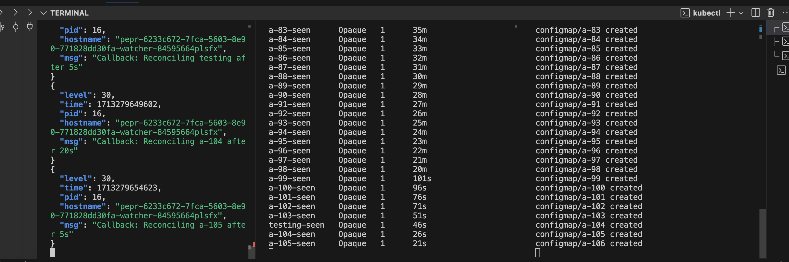

# Soak Test

deploy the module and watch logs in one terminal

In another terminal create a `ConfigMap` every 60 seconds

```bash
for x in $(seq 999);
do
kubectl create cm a-$x -n pepr-demo --from-literal=a=a;
sleep 60; 
done
```

In another terminal get secrets every 60 seconds

```bash
for x in $(seq 999);
do
kubectl get secret -n pepr-demo;
sleep 60; 
done
```


**CORRECT RESULT** - There is always a corresponding secret for each configmap

## Audit Cluster 

```yaml
cat <<EOF >>config.yaml
kind: Cluster
apiVersion: kind.x-k8s.io/v1alpha4
nodes:
- role: control-plane
  extraMounts:
    - hostPath: ./audit-policy.yaml
      containerPath: /etc/kubernetes/audit-policy.yaml
  kubeadmConfigPatches:
    - |
      kind: ClusterConfiguration
      apiServer:
        extraArgs:
          audit-policy-file: /etc/kubernetes/audit-policy.yaml
          audit-log-path: /var/log/kubernetes/audit.log
          audit-log-maxage: "30"
          audit-log-maxbackup: "10"
          audit-log-maxsize: "100"
EOF
cat <<EOF >>audit-policy.yaml
apiVersion: audit.k8s.io/v1
kind: Policy
rules:
  - level: Metadata
EOF
kind create cluster --config config.yaml
```

View Audi logs

```bash
docker ps | grep kube-apiserver
docker exec -it <container-id> cat /var/log/kubernetes/audit.log
```


Results:

April 16 - worked for 174 minutes

## Random Debugging 


```bash
kubectl apply -f -<<EOF
apiVersion: v1
kind: Pod
metadata:
  creationTimestamp: null
  labels:
    run: test
    batch.kubernetes.io/job-name: "yes"
    service.istio.io/canonical-name: "yes"
    zarf.dev/agent: ignore 
  name: testt
  namespace: neuvector
spec:
  containers:
  - image: ubuntu
    command: ["sh", "-c", "sleep 9999"]
    name: test
    resources: {}
  dnsPolicy: ClusterFirst
  restartPolicy: Always
status: {}
EOF
```
```bash
kubectl apply -f dist/pepr-module-6233c672-7fca-5603-8e90-771828dd30fa.yaml
kubectl create ns pepr-demo
sleep 15
kubectl wait --for=condition=read po -l pepr.dev/controller=watcher --timeout=300s
kubectl logs -n pepr-system -l pepr.dev/controller=watcher -f | jq 'select(.url != "/healthz")'
```
`jq 'select(.msg | test("^Watch event.+"))' `
`jq 'select(.msg | test("^EndpointSlice.+"))' `
```bash
k logs -n pepr-system deploy/pepr-uds-core-watcher --since=1h |jq 'select(.msg | test("^Processing Pod.+"))' | less

k logs -n pepr-system deploy/pepr-uds-core-watcher --since=1h |jq 'select(.msg | test("^Invalid pod.+"))' | less

k logs -n pepr-system deploy/pepr-uds-core-watcher --since=1h | egrep "for istio job termination" | jq 'select(.msg | test("neuvector-updater-pod-28563738-z8s9l "))'


kubectl get events --field-selector involvedObject.name=pod_name

k logs -n pepr-system pepr-uds-core-watcher-b8d8c5c5b-mzh45  --since=5m  | jq 'select(.url != "/healthz")' | jq 'select(.msg | test("^Processing Pod.+"))' | grep Processing
```
